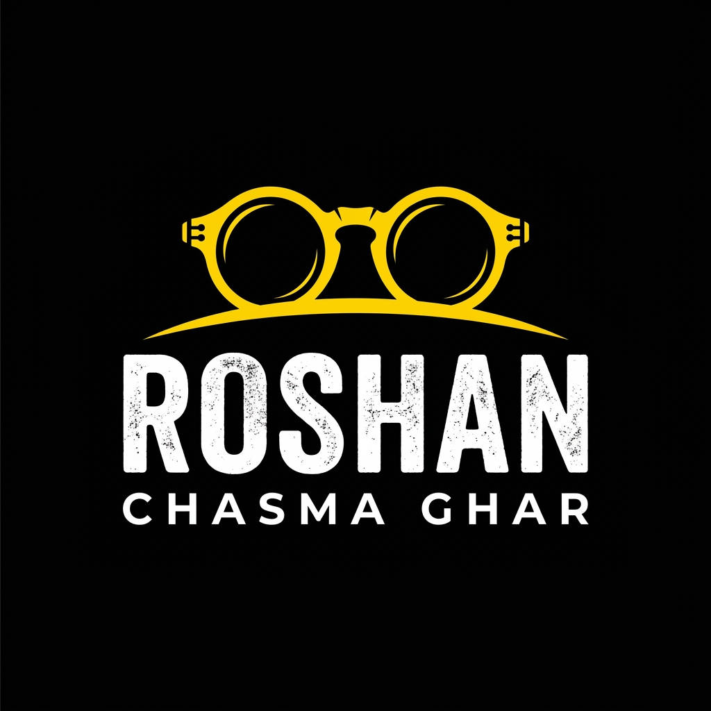

# Roshan Chasma Ghar — Opticians & Vision Care (Estd. 1982)



A luxury eyewear atelier, digital dispensary, and computerized optometry clinic web application for **Roshan Chasma Ghar**. Handcrafted lightweight frames, Japanese beta-titanium silhouettes, Zeiss DuraVision® certified lenses, and computerized 14-point eye exam booking.

---

## 🌟 Key Features

- **Virtual Frame Try-On**: Live webcam & multi-model facial try-on with real-time lens tint and frame preview.
- **Precision Optical Catalog**: Curated collections of eyeglasses, titanium frames, sunglasses, computer blue-cut spectacles, and optical care accessories.
- **Interactive Lens Customizer**: Select Zero-Power Blue-Block, Single Vision Prescription, or Zeiss Precision Plus progressive corridors.
- **Digital Prescription Upload**: Medical prescription upload and power dial-in (Sphere, Cylinder, Axis, Add, Pupillary Distance).
- **Computerized Clinic Booking**: 14-point optometry eye test scheduling with instant confirmation and Supabase persistence.
- **Responsive Mobile Experience**: Native mobile bottom navigation, thumb-friendly touch targets, and responsive cart drawer.

---

## 🚀 Getting Started

### Prerequisites

- Node.js (v18 or higher)
- npm or bun

### Installation

```bash
# Clone the repository
git clone <your-repository-url>
cd roshan-chasma-ghar

# Install dependencies
npm install

# Start the development server
npm run dev
```

Visit `http://localhost:3000` to view the application.

### Building for Production / GitHub Pages

```bash
# Compile and build production bundle
npm run build
```

The output will be placed in the `dist/` directory with relative asset paths configured for deployment on GitHub Pages or custom hosting.

---

## 📂 Project Structure

```
├── public/                 # Static assets (logo, icons, public images)
│   ├── logo.png
│   ├── images/
│   └── roshan-logo.svg
├── src/
│   ├── assets/images/      # Optical showcase photography & banners
│   ├── components/         # Reusable UI components & modals
│   ├── context/            # Auth and application state
│   ├── data/               # Product catalog & optical specifications
│   ├── pages/              # Catalog, Clinic, Detail, Cart, About, Offers
│   ├── services/           # Supabase cloud database & booking services
│   ├── types/              # TypeScript interfaces
│   ├── App.tsx             # Main routing & application root
│   └── main.tsx            # Application entrypoint
├── index.html              # HTML shell with meta tags & typography
└── vite.config.ts          # Vite build config with relative base for GitHub
```

---

© 1982–2026 Roshan Chasma Ghar. All rights reserved.
